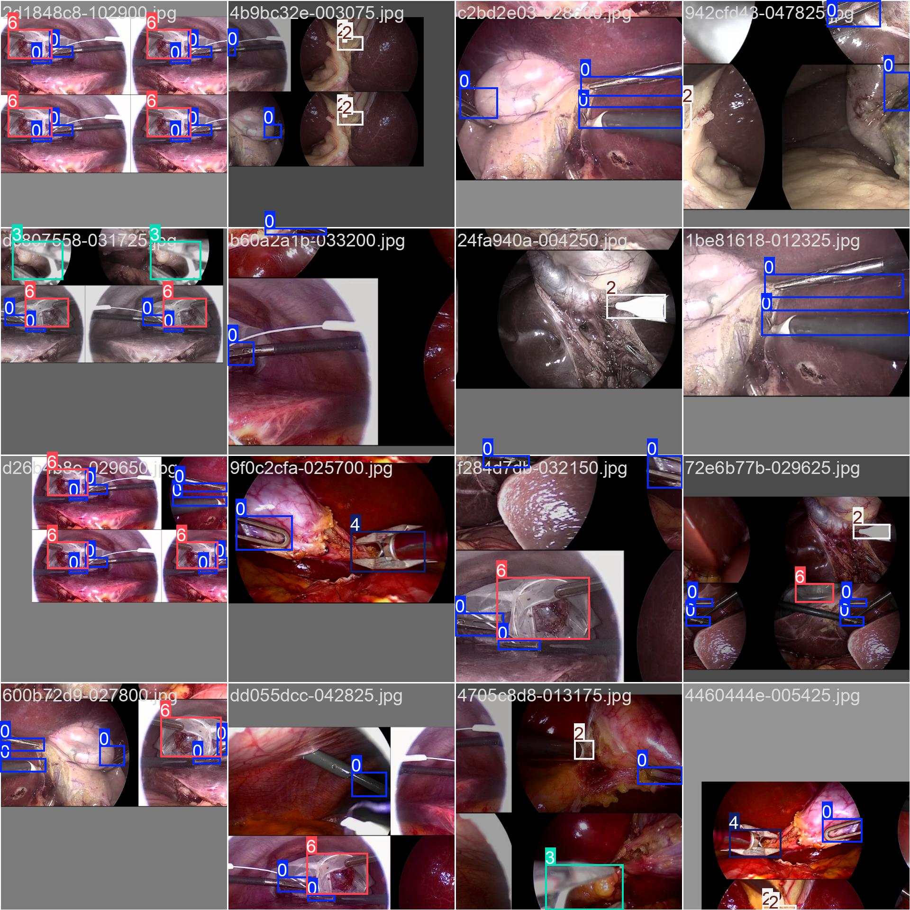
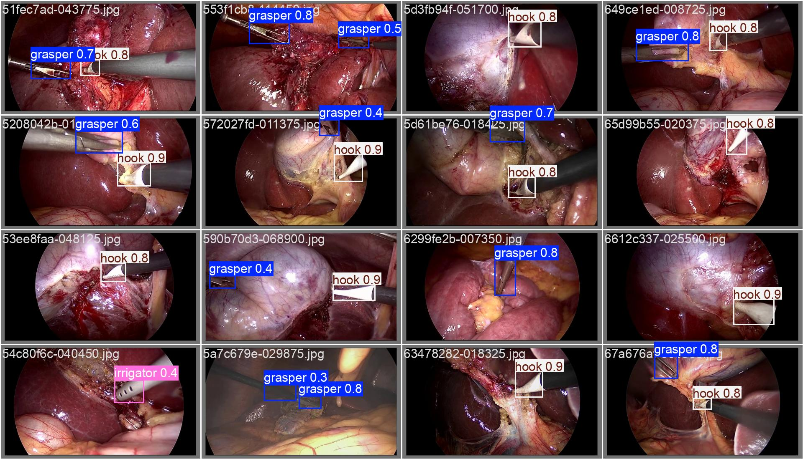
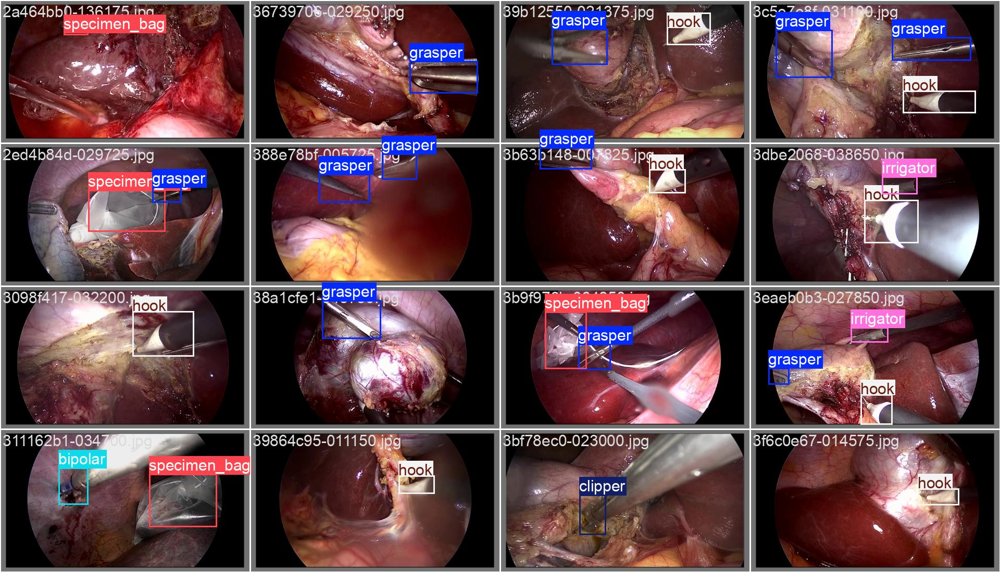
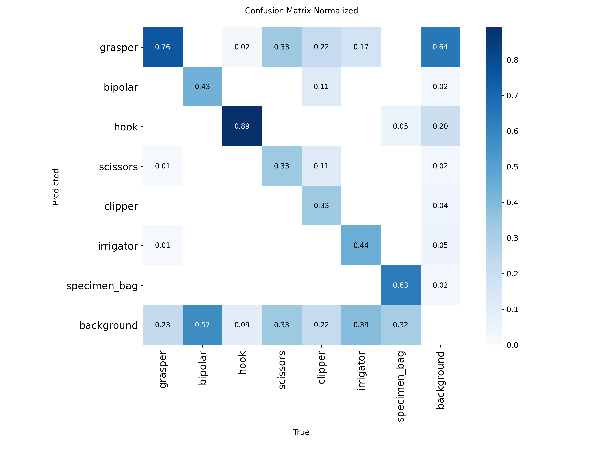

# 🧠 Surgical Tool Detection using YOLOv11n

A deep learning project for detecting surgical tools in laparoscopic videos using the **YOLOv11n** object detection model trained on the Cholec80 dataset.

---

## 📌 Table of Contents

- [Introduction](#introduction)
- [Dataset](#dataset)
- [Data Collection & Annotation](#data-collection--annotation)
- [Model Architecture & Training](#model-architecture--training)
- [Results](#results)
- [How to Run](#how-to-run)
- [Future Enhancements](#future-enhancements)
- [Credits](#credits)

---

## 🔍 Introduction

In laparoscopic surgeries, identifying surgical tools in real time helps automate surgical workflow analysis, aid in education, and improve patient safety. This project uses YOLOv11n to detect surgical tools from frames extracted from the Cholec80 dataset.

---

## 📂 Dataset

- **Dataset**: [Cholec80](https://camma.unistra.fr/datasets/)
- **Contents**: 80 laparoscopic surgery videos (~69 GB)
- **Tool labels**: Grasper, Hook, Scissors, Clipper, etc.
- **Annotations**: Created using bounding boxes, then converted to YOLO format

---

## 🖊️ Data Collection & Annotation

- Frames were extracted from videos at specific intervals.
- 1000+ frames were annotated using [Label Studio](https://labelstud.io).
- Classes include common laparoscopic tools.
- Converted to YOLO format for compatibility with YOLOv11n.

📸 **Example annotated image**:



---

## ⚙️ Model Architecture & Training

- **Model**: YOLOv11n (YOLO version 11 nano)
- **Platform**: Google Colab with Tesla T4 GPU
- **Hyperparameters**:
  - Epochs: 50
  - Image Size: 640x640
  - Optimizer: SGD
  - Batch Size: 16
- Final model saved as: `models/best.pt`

📓 Training notebook: [`training.ipynb`](training.ipynb)

---

## 📊 Results

| Metric         | Value   |
|----------------|---------|
| Precision      | 0.7338  |
| Recall         | 0.5669  |
| mAP@0.5        | 0.5904  |
| mAP@0.5:0.95   | 0.2304  |

📸 **Sample YOLOv11n prediction outputs**:




---
### Confusion Matrix

The following confusion matrix shows how the model performs across different tool classes:


## ▶️ How to Run

1. **Clone the repository**:

```bash
git clone https://github.com/YOUR_USERNAME/Cholec80-Surgical-Tool-Detection.git
cd Cholec80-Surgical-Tool-Detection
Install dependencies:

bash
Copy
Edit
pip install -r requirements.txt
Run inference:

bash
Copy
Edit
yolo detect predict model=models/best.pt source=data/images/
🔗 Download best.pt if not available here: Google Drive Link

🌱 Future Enhancements
Add more annotated images for better prediction

Add Surgical Phase Detection using temporal models (e.g., LSTMs, Transformers)

Real-time deployment on surgical edge devices

Integration into hospital video recording systems

Build an intuitive GUI for clinicians

🙌 Credits
Dataset: CAMMA Lab – Cholec80

Model: YOLOv11n (Ultralytics)

Annotation: Label Studio

Training Platform: Google Colab


💬 Feedback or Contributions
Feel free to raise an issue or submit a pull request.

markdown
Copy
Edit

---

